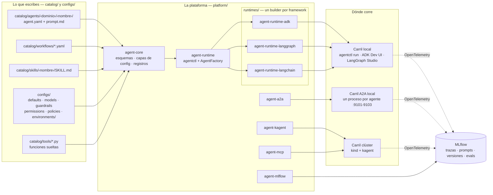
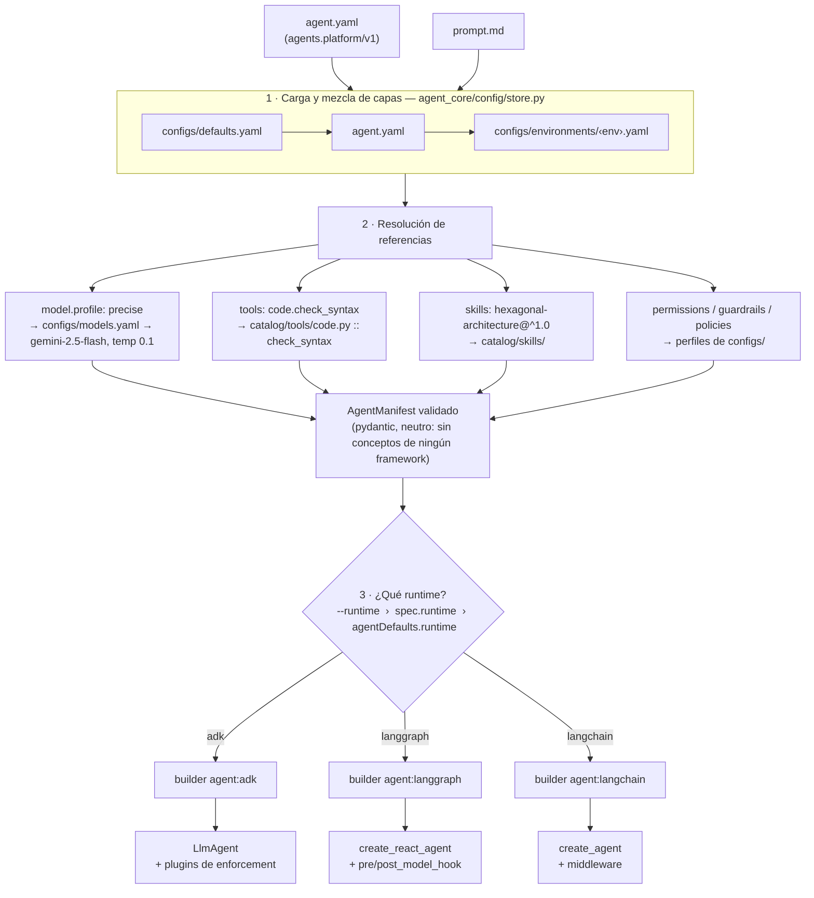
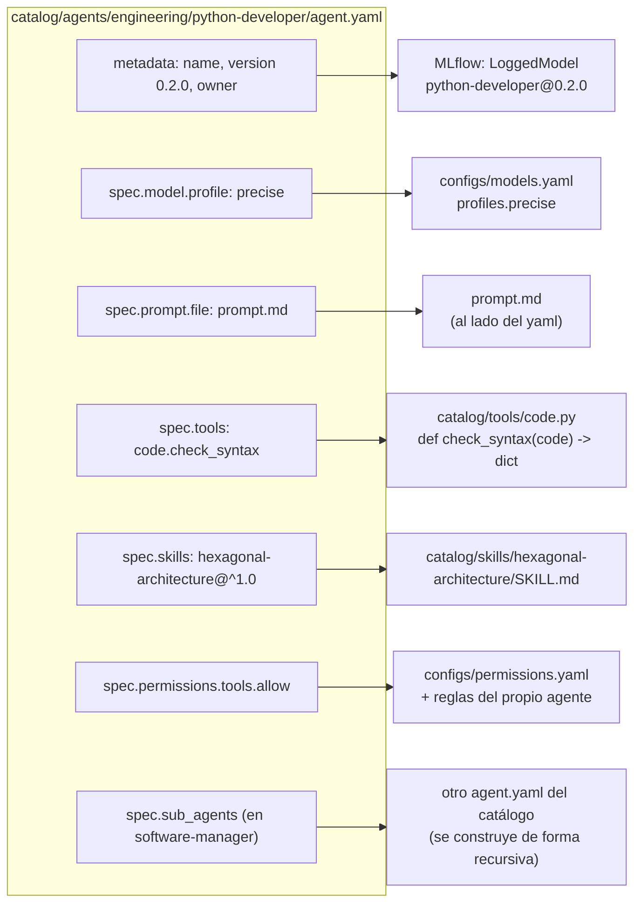
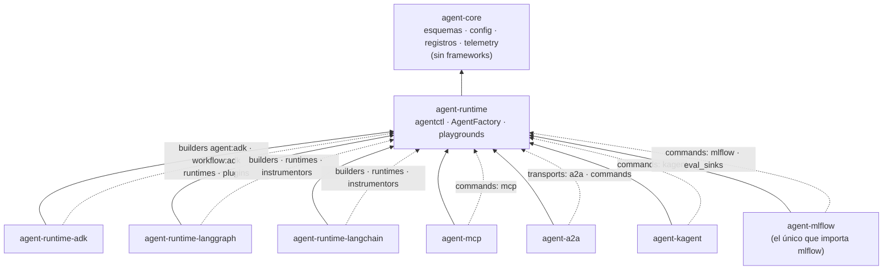
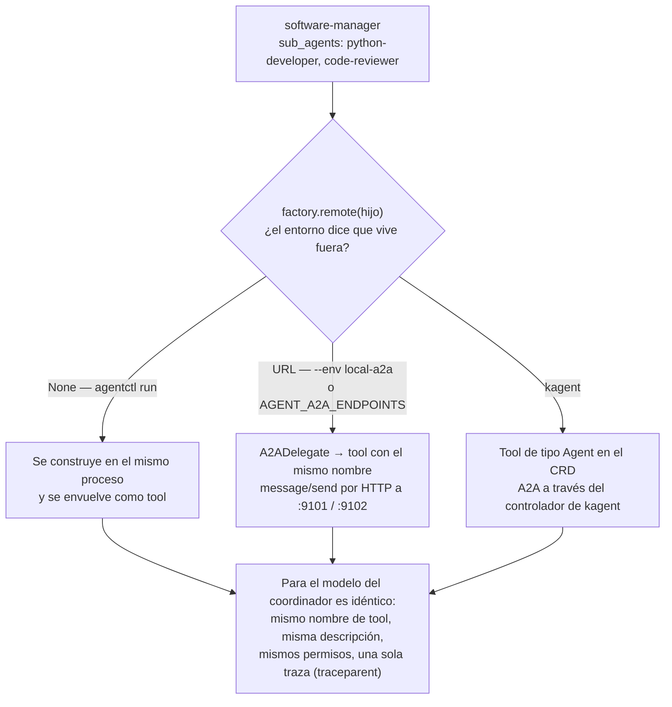
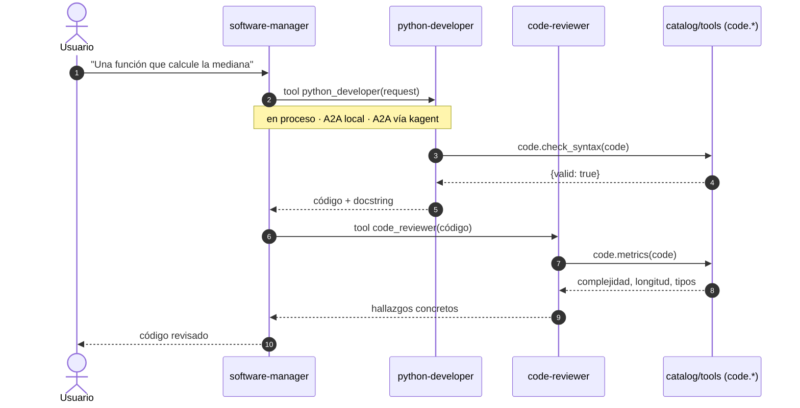
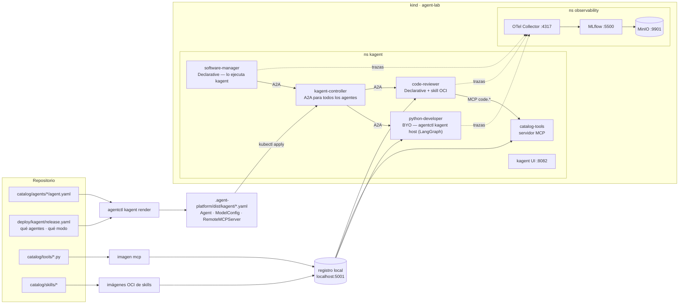
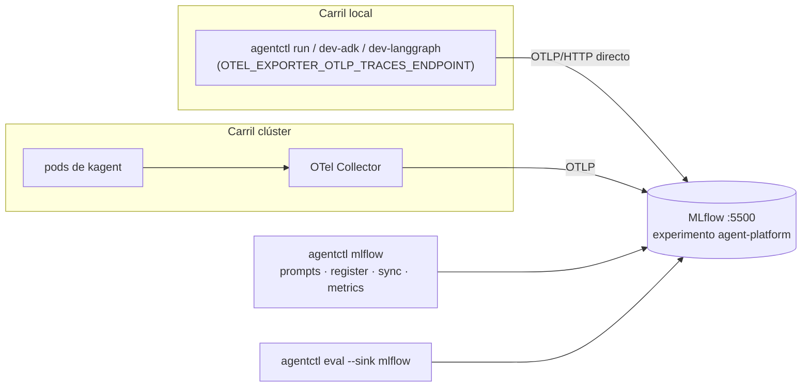

# Agent Platform

Un marco de referencia para desarrollar agentes **una vez** y ejecutarlos donde
haga falta: en tu portátil con el framework que prefieras, o en Kubernetes con
kagent, siempre con la misma observabilidad.

- **Un manifiesto, tres frameworks.** Cada agente es un `agent.yaml`
  (`agents.platform/v1`). ADK, LangGraph o LangChain lo construyen; se elige con
  una línea (`spec.runtime`) o un flag (`--runtime`).
- **Tools por MCP, agentes por A2A.** Las funciones de `catalog/tools/` se
  publican como servidor MCP; los agentes desplegados hablan entre sí por A2A.
- **kagent como runtime.** Los CRDs de kagent se **generan** desde los
  manifiestos: agentes declarativos (sólo YAML) o BYO (nuestro runtime dentro de
  kagent).
- **MLflow como backend de AgentOps.** Trazas por OpenTelemetry, Prompt Registry,
  una versión registrada por cada `nombre@versión` de agente, evals y métricas.

La regla que sostiene todo: **cambiar un agente nunca debería requerir un release
de la plataforma**. Si para cambiar un prompt, un modelo o un permiso hay que
tocar Python, el diseño ha fallado.

El caso de uso de la demo es **ingeniería de software**: un jefe de desarrollo
(`software-manager`) recibe un requisito, lo delega por A2A en un desarrollador
(`python-developer`) y pasa el resultado a un revisor (`code-reviewer`) que
fundamenta sus hallazgos con análisis estático servido por MCP.

> ¿Primera vez? Mira los diagramas de [Arquitectura](#arquitectura) y sigue por
> [Explora los casos de uso](#explora-los-casos-de-uso), que no necesita clúster. Para entender el porqué: [`docs/concepts.md`](docs/concepts.md)
> (framework vs runtime vs protocolo, con el diagrama del flujo). Para presentarlo:
> el guion de [`docs/demo.md`](docs/demo.md).

---

## Arquitectura

La idea central cabe en una frase: **cada agente es sólo un `agent.yaml` y un
`prompt.md`**. Al arrancar, la plataforma lee ese manifiesto y construye con él un
agente del framework que toque —ADK, LangGraph o LangChain—. Es **el mismo YAML
para los tres**; sólo cambia el *builder* que lo traduce. Ningún agente del
catálogo tiene una línea de Python.

Los diagramas van de lo general a lo concreto. El detalle de cada paquete está en
[`docs/architecture.md`](docs/architecture.md).

### 1. El mapa completo

Qué se escribe (izquierda), quién lo convierte en algo ejecutable (centro) y
dónde acaba corriendo y observándose (derecha).



### 2. Un manifiesto, tres frameworks

El recorrido de `python-developer` desde el disco hasta un objeto del framework.



La precedencia del runtime es la misma que la de cualquier otro ajuste: el flag
del CLI gana al manifiesto, y el manifiesto a los valores de la flota. Hoy
`configs/defaults.yaml` dice `runtime: adk`.

### 3. Qué se convierte en qué

Cada campo del manifiesto tiene su equivalente en los tres frameworks. Esta tabla
es, literalmente, lo que hacen los tres `builder.py`.

| En el `agent.yaml` | ADK | LangGraph | LangChain |
|---|---|---|---|
| `prompt` (+ índice de skills) | `LlmAgent(instruction=)` | `create_react_agent(prompt=)` | `create_agent(system_prompt=)` |
| `model.profile` | nombre del modelo + `generate_content_config` | chat model de LangChain | chat model de LangChain |
| `tools: [code.check_syntax]` | `FunctionTool` | `StructuredTool` | `StructuredTool` |
| `skills` | dos `FunctionTool` que sirven el `SKILL.md` | dos `StructuredTool` | dos `StructuredTool` |
| `sub_agents` · `mode: tool` | `AgentTool(hijo)` | tool que llama a `hijo.invoke()` | tool que llama a `hijo.invoke()` |
| `sub_agents` · otro modo | `sub_agents=[…]` (cede el turno) | ❌ error explicado | ❌ error explicado |
| `guardrails` · `permissions` · `policies` | plugins de ADK | `pre_model_hook` / `post_model_hook` | middleware |
| `kind: Workflow` | `LoopAgent` (loop) · `Workflow` con aristas (el resto) | `StateGraph` | LCEL: secuencia o `RunnableParallel` (sin bucles ni DAG) |

### 4. Anatomía de un agente

Todo lo que aparece en un `agent.yaml` es una **referencia por nombre** a algo
que vive en otro sitio. Por eso cambiar un modelo, un permiso o una tool no
requiere tocar Python.



Una tool es una función con type hints y docstring: el registro las descubre
solas al arrancar (`agent_runtime/context.py`), y la firma **es** el esquema que
ve el modelo. Soltar un `.py` en `catalog/tools/` basta para publicarla.

### 5. Cómo se enchufan los paquetes

Nadie importa a nadie por nombre. Cada paquete se anuncia por *entry points* en
su `pyproject.toml`, así que **instalar un paquete es lo que hace que su
capacidad exista**. Por eso añadir un cuarto framework sería un paquete nuevo, no
un cambio en la fábrica.



Las flechas sólidas son dependencias de instalación; las punteadas, lo que la
fábrica y `agentctl` descubren en tiempo de ejecución.

### 6. Delegación: el sub-agente no sabe dónde vive el otro

`software-manager` declara `sub_agents: [python-developer, code-reviewer]` con
`mode: tool`. El manifiesto es el mismo en los tres carriles; lo que cambia es lo
que `factory.remote()` responde al construirlo.





### 7. El carril clúster: de manifiesto a pods

`agentctl kagent render` traduce los mismos manifiestos a CRDs de kagent según
[`deploy/kagent/release.yaml`](deploy/kagent/release.yaml), que decide **dónde y
cómo** corre cada agente. El `agent.yaml` no sabe que existe kagent.



| Modo | Quién ejecuta el agente | Lo que aprovecha | Límite |
|---|---|---|---|
| **Declarative** | el motor de kagent | sólo YAML, UI y A2A gratis | no sabe expresar guardrails, políticas ni temperatura (se avisa al renderizar) |
| **BYO** | nuestro runtime en un pod (`agentctl kagent host`) | todo el manifiesto, con enforcement | necesita la imagen `agent-host` |

### 8. Observabilidad: la misma traza en los tres carriles



MLflow escucha en `localhost:5500` en los dos carriles: el del clúster por
NodePort o, sin clúster, `make mlflow-local`. Nunca los dos a la vez; el Makefile
y `cluster-up.sh` lo comprueban antes de arrancar.

### 9. Carriles y puertos

| Carril | Se levanta con | Puertos del host |
|---|---|---|
| Local | `make dev-adk` · `dev-langgraph` · `mcp` · `mcp-inspector` | 8000 · 2024 · 8001 · 6274 |
| A2A local | `make a2a-up` | 9101 · 9102 · 9103 |
| MLflow sin clúster | `make mlflow-local` | 5500 |
| Clúster | `make lab` | 8082 (kagent) · 5500 (MLflow) · 9901 (MinIO) · 5001 (registro) · 8083 (`make kagent-a2a`) |

Los carriles local y clúster no comparten puertos salvo el 5500, que es a
propósito. Todo lo que habla con Kubernetes va contra el contexto
`kind-agent-lab`, nunca contra el contexto activo de `kubectl`.

---

## Explora los casos de uso

```bash
make install                   # .venv con todos los paquetes
cp .env.example .env           # pon tu GOOGLE_API_KEY
make casos                     # el menú: qué caso es cada número
make caso-3                    # y a jugar
```

Cada caso añade **una** forma de colaborar a la anterior. Todos narran en la
terminal el trabajo que la respuesta final esconde: quién delega en quién, qué
tools llama cada uno y qué viaja por A2A.

| # | Pruébalo | Qué colaboración ves | Míralo también en una UI |
|---|---|---|---|
| 1 | `make caso-1` | `greeting`: ninguna, un modelo con instrucciones | `make dev-adk AGENT=greeting` |
| 2 | `make caso-2` | `health-advisor`: un agente que llama a **tools** (código Python) | `make dev-adk AGENT=health-advisor` (pestaña *Events*) |
| 3 | `make caso-3` | `software-manager`: **delegación decidida por el modelo**. El jefe llama a `python-developer` y a `code-reviewer`, y si la revisión encuentra un fallo, vuelve al desarrollador | `make dev-adk AGENT=software-manager` |
| 4 | `make caso-4` | `research-and-write`: **flujo secuencial**. El orden lo fija el YAML, no el modelo | `make dev-langgraph` (el grafo) |
| 5 | `make caso-5` | `parallel-briefing`: **en paralelo**, dos agentes sobre el mismo tema | `make dev-langgraph` |
| 6 | `make caso-6` | `review-loop`: **bucle** desarrollador ↔ revisor, dos vueltas | `make dev-langgraph` |
| 7 | `make caso-7` | El 3 por **A2A**: cada sub-agente en **su proceso y su framework** | La terminal de `make a2a-up` |
| 8 | `make caso-8` | `data-consumer` → `data-provider`: **dos organizaciones** por A2A. B pregunta a A qué datos tiene y decide si su política permite el uso | La terminal de `make a2a-up` |
| 9 | `make lab` | `software-manager` en **kagent**: A2A entre **pods** | El [chat del jefe](http://localhost:8082/agents/kagent/software-manager/chat) en kagent |

Para jugar con cualquiera:

```bash
make caso-3 MSG="Una función que convierta grados Celsius a Fahrenheit"   # tu mensaje
make caso-3 RUNTIME=langgraph                                              # otro framework: adk | langgraph | langchain
make caso-8 MSG="Datos de movilidad en bicicleta para investigación"       # misma pregunta, otro propósito
```

Cada caso imprime primero el comando `agentctl` que ejecuta, así que de paso lo
aprendes. Para usar `agentctl` directamente, `source .venv/bin/activate` (sin eso,
`command not found`). En resumen: `make` para enseñar, `agentctl` para lo que
`make` no cubre (`show`, `validate`, `a2a send`...), y las UIs para verlo en pantalla.

**Los casos A2A (7 y 8) se montan solos.** Si los sub-agentes no están escuchando,
`make` los levanta en segundo plano (log en `.agent-platform/a2a.log`; se paran
con `make a2a-down`). Para una demo, mejor verlos: `make a2a-up` en una terminal y
`make caso-7` en otra, una al lado de la otra.

El 3 y el 7 son el mismo agente y el mismo manifiesto. Así se ve el 7 (real,
recortado): el jefe corre en ADK, el desarrollador en LangGraph y el revisor en
LangChain, en otro proceso.

```text
▶ software-manager
  → delega en python-developer
    ⇄ A2A message/send → http://localhost:9101/
    ⇄ A2A message (8.8s)
  ← python-developer responde (8.8s): def validate_spanish_iban(iban: str) -> bool: …
  → delega en code-reviewer
    ⇄ A2A message/send → http://localhost:9102/
    ⇄ A2A message (17.8s)
  ← code-reviewer responde (17.8s): Hallazgos del análisis estático …
  → delega en python-developer          ← el jefe devuelve el bug que encontró el revisor
```

Y en la terminal de `make a2a-up`, lo que hace cada sub-agente al recibir la petición:

```text
⇠ A2A code-reviewer: def validate_spanish_iban(iban: str) -> bool: …
▶ code-reviewer
  · code_metrics(def validate_spanish_iban(…) = {"functions": [{"name": "validate_spanish_iban", …
  · code_find_smells(def validate_spanish_iban(…) = {"smells": []}
⇢ code-reviewer (17.8s): Hallazgos del análisis estático …
```

Para trastear:

- **Otro framework, mismo agente:** `agentctl --runtime langgraph run software-manager -v -m "..."`
  (`adk`, `langgraph` o `langchain`; `review-loop` no existe en LangChain, que no tiene bucles).
- **Otro reparto en A2A:** `make a2a-up A2A_AGENTS="python-developer:adk code-reviewer:langgraph"`.
- **Hablar con un agente A2A a mano:** `agentctl a2a card http://localhost:9101/` y
  `agentctl a2a send http://localhost:9101/ -m "Una función que sume dos enteros"`.
- **Tirar un sub-agente:** para `make a2a-up` a mitad de una petición. El jefe
  recibe el error como resultado de la tool y lo cuenta en su respuesta; no se cae.
- **Ver lo mismo en una UI:** `make dev-adk AGENT=software-manager` (pestaña *Events*),
  `make dev-langgraph` (el grafo) o las [trazas de MLflow](http://localhost:5500/#/experiments/0/traces)
  (`make mlflow-local` si no hay clúster).

### El caso más pequeño de A2A: dos organizaciones

`software-manager` enseña a delegar. `data-consumer` enseña **por qué A2A**: dos
organizaciones que no comparten código, ni modelo, ni datos. Solo se hablan.

| | Organización A · `data-provider` | Organización B · `data-consumer` |
|---|---|---|
| Qué tiene | Una tool, [`dataspace.search_datasets`](catalog/tools/dataspace.py): tres datasets, cada uno con su política de uso | Nada propio: ni datos ni tools |
| Qué hace | Responde qué ofrece sobre un tema, con la política tal cual | Pregunta a A y decide si la política permite el uso del usuario |
| Dónde corre | Su proceso, en LangGraph (`make a2a-up`, :9103) | El tuyo, en ADK (`make caso-8`) |

Prueba el mismo tema con dos propósitos. La respuesta cambia por la política de
A, no por el prompt de B:

```text
"Datos de movilidad en bicicleta para un producto comercial"  → No: commercial: false
"Datos de movilidad en bicicleta para investigación"          → Sí: purposes incluye research
"Datos de calidad del aire para una app comercial"            → Sí: commercial: true
```

En la terminal de B ves la pregunta salir por A2A. En la de A, la tool que llama
para contestar, que B no ve ni necesita ver:

```text
▶ data-consumer                                 ⇠ A2A data-provider: datos de movilidad en bicicleta
  → delega en data-provider                     ▶ data-provider
    ⇄ A2A message/send → http://localhost:9103/   · dataspace_search_datasets(bicicleta) = {"datasets": …
  ← data-provider responde (2.4s): …            ⇢ data-provider (2.3s): …
```

En un espacio de datos real, la tool de A sería el catálogo de su conector EDC y
la política, una oferta ODRL. La conversación entre los dos agentes no cambiaría.

### A2A: en proceso, entre procesos, entre pods

Dónde vive un sub-agente es una decisión de **despliegue**, no del agente. El
manifiesto de `software-manager` dice `sub_agents: [python-developer, code-reviewer]`
en los tres casos:

| Carril | Dónde vive cada sub-agente | Cómo viaja la delegación | Quién lo decide |
|---|---|---|---|
| `agentctl run` | En el mismo proceso | Llamada a una tool, en memoria | Nadie: es lo que pasa por defecto |
| `--env local-a2a` | En otro proceso (`make a2a-up`) | **A2A** `message/send` por HTTP | [`configs/environments/local-a2a.yaml`](configs/environments/local-a2a.yaml) (`a2a.endpoints`) o `AGENT_A2A_ENDPOINTS` |
| kagent | En otro pod | **A2A** a través del controlador de kagent | [`deploy/kagent/release.yaml`](deploy/kagent/release.yaml) |

En kagent, un coordinador **declarativo** delega con `tools[type=Agent]`. Uno **BYO**
recibe `AGENT_A2A_ENDPOINTS` de `agentctl kagent render`. En los dos casos cada
salto es A2A: nadie construye copias de los hijos dentro de su pod.

---

## Las UIs

| UI | URL | Se levanta con | Para qué |
|---|---|---|---|
| **kagent** | http://localhost:8082 | `make lab` | Chatear con los agentes desplegados |
| └ chat de `software-manager` | http://localhost:8082/agents/kagent/software-manager/chat | | El jefe de desarrollo: orquesta a los otros dos por A2A |
| └ chat de `code-reviewer` | http://localhost:8082/agents/kagent/code-reviewer/chat | | Revisor declarativo: tools `code.*` por MCP + skill |
| └ chat de `python-developer` | http://localhost:8082/agents/kagent/python-developer/chat | | Desarrollador BYO (LangGraph dentro de kagent) |
| **MLflow** | http://localhost:5500 | `make lab` o `make mlflow-local` | Backend de AgentOps |
| └ Trazas | http://localhost:5500/#/experiments/0/traces | | Una traza por pregunta, con `agent.*` y `prompt.*` |
| └ Versiones de agente | http://localhost:5500/#/experiments/0/models | | Un `LoggedModel` por `nombre@versión` |
| └ Prompts | http://localhost:5500/#/prompts | | Prompt Registry: una versión por texto distinto |
| └ Runs (evals, métricas) | http://localhost:5500/#/experiments/0/runs | | `make eval-run`, `make metrics` |
| **MinIO** | http://localhost:9901 | `make lab` | Artefactos de MLflow (`minioadmin` / `minioadmin`) |
| **ADK Dev UI** | http://localhost:8000/dev-ui/?app=python_developer | `make dev-adk` | Playground de ADK, 100 % local: todo el catálogo en el desplegable, con guardrails y permisos activos |
| **LangGraph Studio** | https://smith.langchain.com/studio/?baseUrl=http://127.0.0.1:2024 | `make dev-langgraph` · `make dev-langchain` | El grafo de cada agente; la UI se sirve desde smith.langchain.com |
| └ API de LangGraph | http://127.0.0.1:2024/docs | | La misma API, sin la UI remota |
| **MCP** (`catalog-tools`) | http://localhost:8001/ | `make mcp` | Qué publica el servidor. El endpoint del protocolo es `/mcp`: para clientes MCP (IDE, Inspector), no para el navegador |
| **Agentes A2A** (local) | http://localhost:9101/.well-known/agent-card.json · :9102 | `make a2a-up` | La tarjeta de cada sub-agente; `make a2a-cards` las imprime |
| **MCP Inspector** | la URL con token que imprime al arrancar (`http://127.0.0.1:6274?MCP_INSPECTOR_API_TOKEN=…`) | `make mcp` + `make mcp-inspector` | UI oficial de MCP: lista las tools y las llama con argumentos a mano |

`make ui-urls` imprime esta lista. Los tres playgrounds locales comparten
puertos entre sí (Studio sirve LangGraph y LangChain): abre uno cada vez.

---

## El repositorio

Tres verbos, tres zonas: lo que **se publica**, lo que **se ejecuta** y lo que
**lo opera**.

```text
agent-platform/
├── platform/                  LO QUE SE PUBLICA — paquetes Python versionados
│   ├── core/                  agent-core: esquemas, config, registros, skills, evals, tracing. Sin frameworks
│   ├── runtime/               agent-runtime: agentctl, la fábrica, los playgrounds
│   ├── runtimes/              agent-runtime-{adk,langgraph,langchain}: manifiesto -> framework
│   ├── mcp/                   agent-mcp: catalog/tools por MCP
│   ├── a2a/                   agent-a2a: servir un agente por A2A, o delegar en uno remoto
│   ├── kagent/                agent-kagent: manifiesto -> CRDs de kagent; host de agentes BYO
│   └── integrations/mlflow/   agent-mlflow: el único paquete que conoce MLflow
│
├── catalog/                   LO QUE SE EJECUTA — lo toca cada equipo
│   ├── agents/<dominio>/<nombre>/   starter · health · content · engineering · quality
│   ├── workflows/*.yaml
│   ├── skills/<nombre>/SKILL.md     instrucciones que el agente lee bajo demanda
│   └── tools/*.py                   funciones sueltas: soltar un .py y ya
├── configs/                   perfiles (modelos, guardrails, permisos, políticas) y entornos
├── evals/<objetivo>/          datasets y criterios: medir, no suponer
│
├── deploy/                    LO QUE LO OPERA
│   ├── kind/                  el clúster del laboratorio
│   ├── observability/         MinIO + MLflow + OTel Collector (kustomize)
│   ├── kagent/                values de Helm y release.yaml (qué agentes, en qué modo)
│   ├── images/                Dockerfiles: agent-host, mcp, mlflow, skill
│   └── scripts/
│
├── docs/                      concepts · demo · architecture · configuration
├── examples/                  la escalera de 4 escalones, a mano en los 3 frameworks
├── tests/                     core · runtime · runtimes · mcp · kagent · integrations · catalog
└── .agent-platform/           TODO lo generado (puentes de UI, CRDs, contratos). Ignorado por git
```

---

## Puesta en marcha

```bash
make install                   # .venv con todos los paquetes en modo editable
cp .env.example .env           # GOOGLE_API_KEY (Gemini)
source .venv/bin/activate      # para usar agentctl directamente; los `make` no lo necesitan
make test                      # ninguno llama al modelo
```

### Carril local — un manifiesto, tres frameworks

```bash
make mlflow-local              # MLflow en :5500 (si no tienes el clúster levantado)

make dev-adk AGENT=python-developer   # ADK Dev UI, 100% local
make dev-langgraph             # LangGraph Studio
make dev-langchain             # LangGraph Studio sobre agentes de LangChain
make run AGENT=software-manager MSG="Una función que valide un IBAN español"   # narra (-v)

make a2a-up                    # los sub-agentes, en otro proceso, por A2A
make caso-7 MSG="..."          # (otra terminal) el jefe delega en ellos
```

Cada ejecución deja su traza en MLflow con `agent.framework` distinto. `make`
sólo activa las trazas si MLflow responde en :5500 (`make mlflow-local`); si no,
el caso corre igual y te lo dice al final.

### Carril clúster — kagent + MLflow

```bash
make lab                       # kind + registro local + MLflow/MinIO/collector + kagent + agentes
make status
```

Tras cambiar un agente: `make deploy` (registra el prompt, regenera los CRDs,
aplica y registra la versión del agente). Para borrarlo todo: `make cluster-down`.

---

## `agentctl`

```bash
agentctl list | show <agente> | validate | components
agentctl run software-manager -v -m "Una función que valide un IBAN español"   # -v: narra el trabajo
agentctl --runtime langgraph run python-developer -m "..."   # el MISMO manifiesto, otro framework
agentctl --runtime adk ui python-developer                    # el playground del framework
agentctl eval --all --check                             # la puerta barata, sin clave
agentctl eval python-developer --sink mlflow            # ejecuta, puntúa y publica
agentctl export --all -o <dir>                          # forma resuelta, para un orquestador
agentctl schema                                         # el JSON Schema, generado de los modelos

agentctl mcp list | serve                               # agent-mcp
agentctl a2a serve <agente[:framework]>... | card <url> | send <url> -m "..."   # agent-a2a
agentctl kagent render | host                           # agent-kagent
agentctl mlflow init | prompts | register | sync | metrics   # agent-mlflow
```

Los cuatro últimos grupos existen porque su paquete está instalado: `agentctl` los
descubre por entry points.

---

## Qué se puede cambiar sin tocar la plataforma

Todo esto es una edición de YAML más `agentctl validate`:

- **Prompts** — inline en `spec.prompt.instruction` o en un `prompt.md`, con variables `{{ }}`.
- **Modelos** — por perfil (`profile: precise`) o con parámetros concretos.
- **Tools** — por referencia (`code.find_smells`); añadir una es soltar un `.py` en `catalog/tools/`.
- **Skills** — `spec.skills: [hexagonal-architecture@^1.0]`; al prompt sólo viaja el índice.
- **Guardrails, políticas y permisos** — perfiles en `configs/`, con overrides por agente.
- **Topología** — un agente pasa a ser paso de un workflow, o delega en otros (`sub_agents`).
- **Dónde vive cada sub-agente** — en proceso o por A2A: `a2a.endpoints` en el entorno.
- **Framework** — `spec.runtime: adk | langgraph | langchain`.
- **Despliegue** — qué agentes corren en kagent y en qué modo: `deploy/kagent/release.yaml`.

Añadir un **tipo nuevo** de cosa (un tipo de guardrail, una forma de orquestación,
un destino de despliegue) sí es código, y se publica como versión nueva del
paquete que toque. Esa es la frontera.

Cómo se combinan las capas (flota, entorno, agente, override): [`docs/configuration.md`](docs/configuration.md).

---

## Documentación

- [`docs/concepts.md`](docs/concepts.md) — framework vs runtime vs protocolo; cómo viaja una petición.
- [`docs/demo.md`](docs/demo.md) — el guion de la demo (25′ y 15′), con plan B.
- [`docs/architecture.md`](docs/architecture.md) — paquetes, entry points, paridad entre frameworks, límites conocidos.
- [`docs/configuration.md`](docs/configuration.md) — referencia campo a campo, generada de los modelos (`make docs`).
- [`catalog/skills/README.md`](catalog/skills/README.md) · [`catalog/tools/README.md`](catalog/tools/README.md) · [`evals/README.md`](evals/README.md)
- [`examples/`](examples/) — la escalera en código nativo de cada framework.
