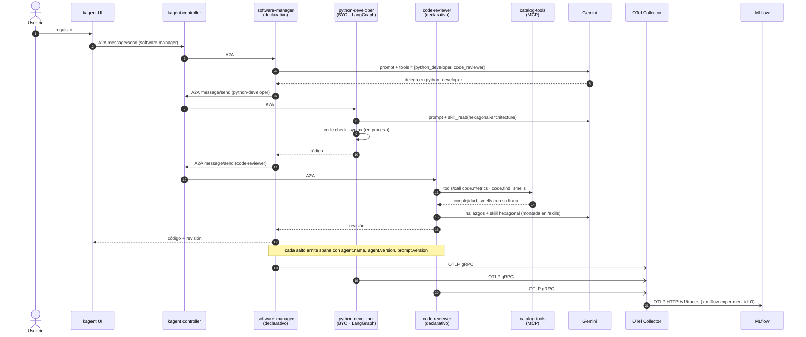
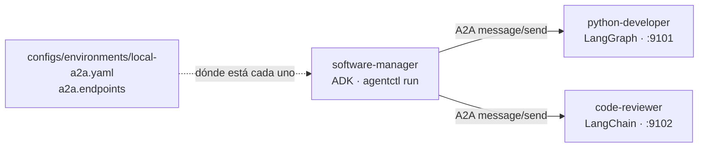
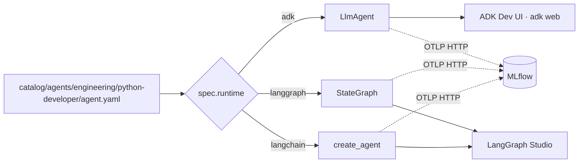

# Conceptos: framework, runtime, protocolo

Tres palabras que se usan como sinónimos y no lo son. Si sólo te quedas con una
cosa de este documento, que sea esta:

> El **framework** es cómo *escribes* el agente. El **runtime** es quién lo
> *ejecuta y opera*. El **protocolo** es cómo *habla* con lo que no es él.

Una analogía que suele funcionar: el framework es tu librería web (Flask,
Spring), el runtime es donde la despliegas (Kubernetes, un servidor de
aplicaciones) y el protocolo es HTTP. Puedes cambiar cualquiera de los tres sin
tocar los otros dos, siempre que respetes el contrato entre ellos.

## La matriz

| | **Framework** | **Runtime** | **Protocolo** |
|---|---|---|---|
| **Pregunta que responde** | ¿Cómo razona el agente, en qué orden llama al modelo y a las tools? | ¿Dónde corre, cómo se despliega, escala, expone y observa? | ¿Cómo se habla con una tool o con otro agente que no es tuyo? |
| **Ejemplos** | LangGraph, LangChain, Google ADK, CrewAI, AutoGen | kagent, LangGraph Platform, Vertex Agent Engine, un Deployment a mano | **MCP** (agente ↔ tools), **A2A** (agente ↔ agente) |
| **Lo que produce** | Un objeto en memoria: un grafo, un `LlmAgent` | Pods, Services, CRDs, una URL, una UI | Mensajes JSON-RPC con un esquema acordado |
| **Si lo cambias...** | reescribes el agente (aquí no: cambias `spec.runtime`) | redepliegas; el agente no se entera | cambias el cliente o el servidor; el otro lado no se entera |
| **En este repositorio** | `platform/runtimes/{adk,langgraph,langchain}` | kagent (`platform/kagent`, `deploy/kagent`) | `platform/mcp` (MCP), kagent + `kagent-langgraph` (A2A) |
| **Dónde lo ves en la demo** | Paso 0: el mismo `python-developer` en tres playgrounds | Pasos 1 y 2: `kubectl get agents`, la UI de kagent | Paso 1: `discoveredTools`; Paso 2: `agent-card.json` |

Dos matices que confunden al principio:

- **"Runtime" tiene dos sentidos.** En `spec.runtime: langgraph`, este repositorio
  llama *runtime* al framework que construye el agente (es el nombre histórico
  del campo). En esta página, *runtime* es la plataforma que lo opera. La tabla
  usa el segundo sentido.
- **kagent también usa un framework por dentro.** Un agente *declarativo* de
  kagent se ejecuta con el motor ADK de kagent (la columna `RUNTIME` de
  `kubectl get agents` dice `go`). No escribes ese código: escribes YAML. Un
  agente *BYO* (*bring your own*) es el caso contrario: tú traes el framework
  y kagent sólo lo opera. La demo tiene uno de cada.

## Las piezas de la demo

El caso de uso es un equipo de desarrollo en miniatura: alguien pide código,
alguien lo escribe y alguien lo revisa.

| Pieza | Qué es | Papel |
|---|---|---|
| `catalog/agents/engineering/*/agent.yaml` | Manifiestos `agents.platform/v1` | La única fuente de verdad de cada agente |
| `software-manager` | Agente **declarativo** en kagent | Jefe de desarrollo: no escribe código, delega por A2A |
| `python-developer` | Agente **BYO** en kagent, LangGraph por dentro | Escribe la función; valida su sintaxis con `code.check_syntax` |
| `code-reviewer` | Agente **declarativo** en kagent | Revisa con `code.metrics` y `code.find_smells` (MCP) |
| `catalog-tools` | Servidor **MCP** (`agent-mcp`) | Publica `catalog/tools/code.py` para quien viva fuera del proceso |
| `hexagonal-architecture` | **Skill** (`SKILL.md`) | La leen desarrollador y revisor cuando el código toca infraestructura |
| OTel Collector | Traductor de telemetría | Recibe OTLP de todos y lo entrega a MLflow |
| MLflow | Backend de AgentOps | Trazas, Prompt Registry, versiones de agente, evals, métricas |
| MinIO | Almacén S3 | Artefactos de MLflow |

## Cómo viaja una petición

Pregunta en la UI de kagent, al `software-manager`: *"Una función que guarde un
pedido en PostgreSQL y devuelva su id."*



La misma petición deja **una sola traza** en MLflow aunque cruce cuatro
procesos: el contexto de traza (`traceparent`) viaja dentro de las llamadas A2A.

Fíjate en las dos formas de usar una tool: `python-developer` llama a
`code.check_syntax` **en proceso** (es nuestro runtime), y `code-reviewer` llama
a las mismas funciones **por MCP** (es el runtime de kagent, que no ejecuta
código de este repositorio). Mismo fichero, `catalog/tools/code.py`.

### Qué span ves en MLflow por cada flecha

Los nombres exactos dependen de la versión de kagent y de las librerías de
instrumentación; los del agente BYO y los del controlador están comprobados en
el laboratorio, los del motor declarativo son orientativos hasta el ensayo con clave.

| Flecha | Span en MLflow | Lo emite |
|---|---|---|
| 2, 3 | `POST /api/a2a/kagent/software-manager/` | kagent controller |
| 4 | `invoke_agent software_manager` · `call_llm` | motor ADK de kagent |
| 6, 7 | `POST /api/a2a/kagent/python-developer/` | kagent controller |
| 8, 9 | `LangGraph` → `model` → `tools` → `skill_read` · `code.check_syntax` | `python-developer` (OpenInference) |
| 11, 12 | `POST /api/a2a/kagent/code-reviewer/` | kagent controller |
| 13 | `execute_tool code.metrics` · `execute_tool code.find_smells` | motor ADK de kagent |

Cada span del agente lleva `agent.name`, `agent.version`, `agent.framework` y
`prompt.hash`/`prompt.version`. Los pone la plataforma
(`agent_core.telemetry.tracing`) o, en los pods de kagent, el collector a partir
de `OTEL_RESOURCE_ATTRIBUTES` (que escribe `agentctl kagent render`).
`agentctl mlflow sync` los sube a etiquetas de la traza, y a partir de ahí se
puede filtrar y agrupar por versión.

## A2A sin kagent

El diagrama de arriba necesita un clúster. La misma delegación, con cada agente
en su proceso y su framework, cabe en un portátil:

```bash
make a2a-up                      # python-developer (LangGraph) :9101 y code-reviewer (LangChain) :9102
make caso-7 MSG="Una función que valide un IBAN español"    # software-manager (ADK), otra terminal
```



El manifiesto de `software-manager` no cambia: `local-a2a.yaml` le dice a la
fábrica que esos dos sub-agentes no se construyen en proceso, sino que están en
una URL. Es la misma decisión que en el clúster toma `release.yaml`. Las dos
terminales narran su mitad (`-v`): la del jefe, las delegaciones y los saltos
A2A; la de los sub-agentes, las tools que llama cada uno.

## El mismo agente sin kagent

El carril local no tiene runtime de plataforma: tu proceso *es* el runtime.



Mismo manifiesto, mismas tools, misma skill, mismo MLflow. Lo único que cambia
es una línea, o un flag: `agentctl --runtime langgraph ui`.
